# Documentos
- DITEC-001 - Proposta educacional do SENAI - SP
- DITEC-002 - Elaboração de Projeto de Curso, Plano de Curso e Ficha de Produto
- DITEC-008 - Planejamento de Ensino e Avaliação da Aprendizagem
- Acordo Coletivo

---
# DITEC-001: Proposta Educacional
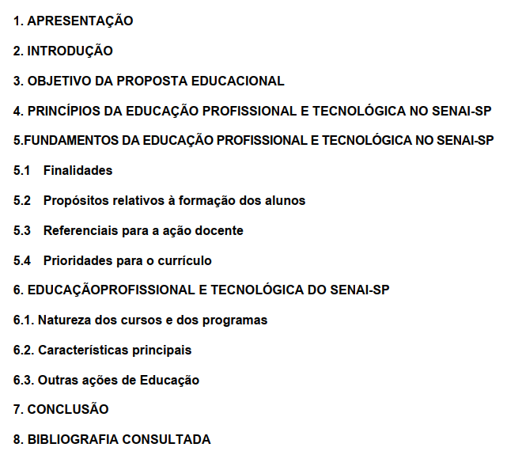

---
# DITEC-002: Proposta Educacional
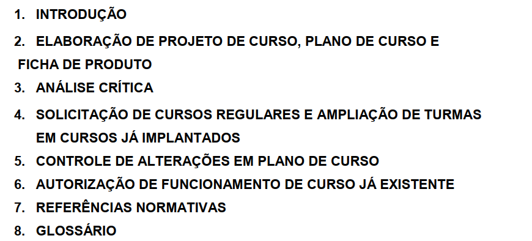

---

# DITEC-008: Planejamento de Ensino e Avaliação da Aprendizagem
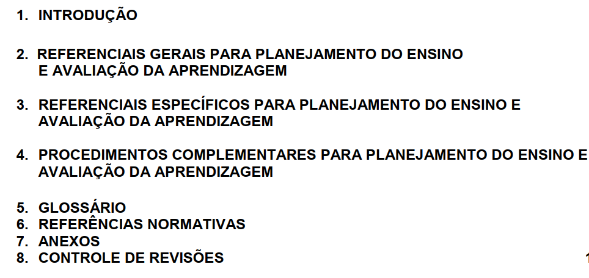

---

# Acordo Coletivo (FEPESP e SENALBA)
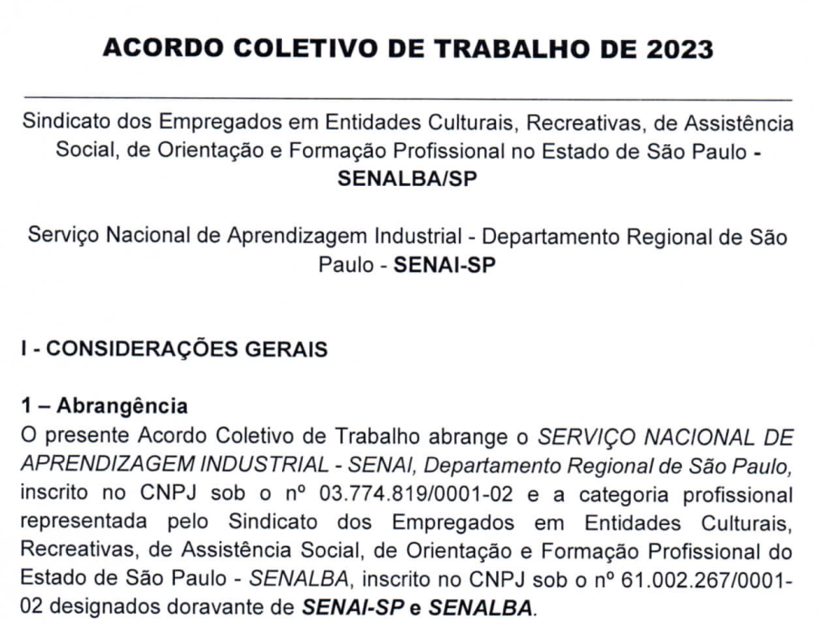

---

# Metodologias e Siglas
- PEARE
- MSEP
- Norteador da Prática Pedagógica
- SMO

---

# Metodologias Siglas
- **PEARE** - Planejamento de Ensino e Avaliação do Rendimento Escolar
- **MSEP** - Metodologia SENAI de Educação Profissional
- **Norteador da Prática Pedagógica**
- **SMO** - Série Metódica Operacional

---

# PEARE
### Planejamento e Avaliação do Rendimento Escolar
Anexo I - do DITEC-008 : Conhecido como metodologia por Conteúdo
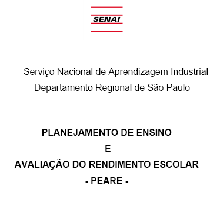 

---

# MSEP
### Metodologia SENAI de Educação Profissional
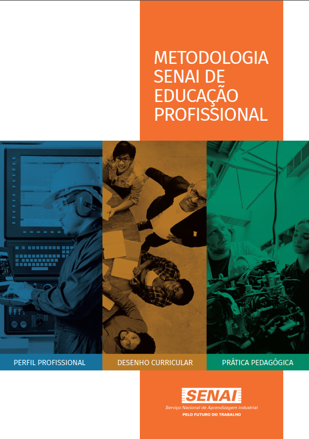

---

# Norteador da Prática Pedagógica
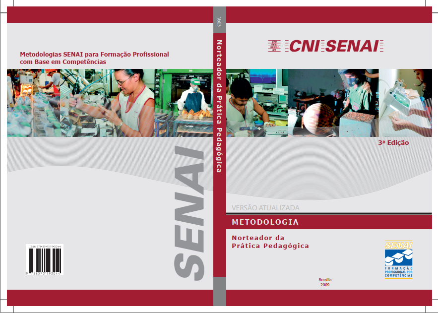

---

## MSEP e Norteador
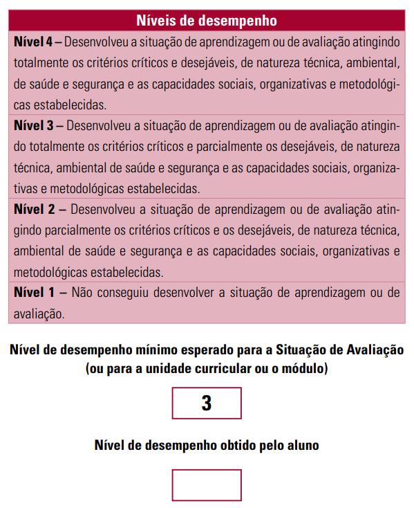
- Competências e Capacidades
- Situações de Aprendizagem
- Critérios:
    - Críticos e Desejáveis
- Níveis de Desempenho
- Avaliação 
    - Formativa e Somativa
- Recuperação Imediata

---

# SMO
### Série Metódica Ocupacional
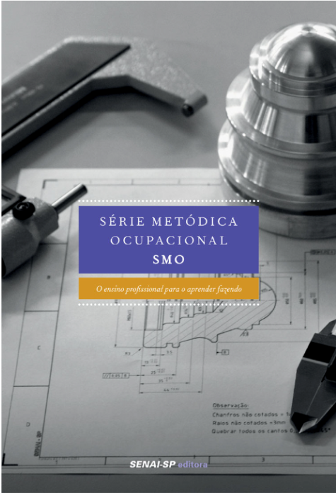

---

# SMO
- SMO - Série Metódica Ocupacional
    - Operações
    - Tarefas
    - Quadro-programa
    - Quadro Analitico
    - FT, FO, FIT (Folhas de tarefa, operação e informação tecnológica)
- **Método de Instrução Individual**

---

# SMO
- Método de Instrução Individual
    1. Estudo da Tarefa
    1. Demostração
        - direta
        - indireta (filmes, simuladores)
    1. Execução da Tarefa (e acompanhamento do docente)
    1. Avaliação

---

# Procedimentos de Compras
- 3 orçamentos
    - Menor preço por item
    - Menor preço Global
- Dispensa de Orçamentos (até meio salário mínimo)
- Forma de Pagamento: Depósito Bancário (após nota e recibo)
- Carrinho (Portal de Compras - Intranet)
- Cadastro de itens (GAF e indicados)
- Expanão de itens

---

# Procedimentos de Manutenção
~~- DITEC-035 - Manutenção~~
- Preventiva
- Corretiva
- Preditiva

- __Sistemática__ (Preventiva)

---

# Procedimentos de Manutenção
## Manutenção Sistemática:
 Ato de examinar e checar um equipamento, com a finalidade de localizar possíveis danos e analisar para saber se as condições técnicas do equipamento estão em estado de operação com confiabilidade

---

# Procedimentos de Manutenção
## SAP
- ZPM0004 (Ordem de Manutenção com Rateio)
    - 60% - Aprendizagem Industrial
    - 40% - Técnico de Nível Médio

- Corretiva, Planejada ou Preventiva

- IW32 - Aprovação da Manutenção 

---

# Vale Refeição (Acordo Coletivo)

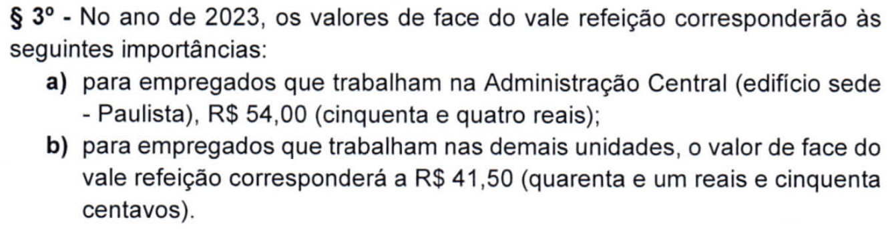

---

# Vale Refeição (Acordo Coletivo)
### Tabela de participação FEPESP
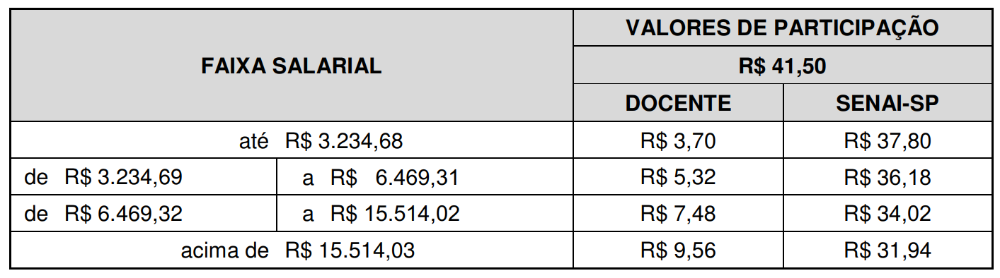

---

# Vale Alimentação (Acordo Coletivo)
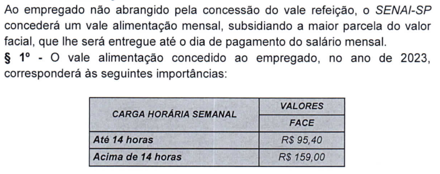

---

# Reembolso de Despesas (SAP - TRIP)
- Hospedagem
- Transporte
- Refeições
    - Subsídio Almoço
    - Completo Jantar
- Combustível
    - 25% Gasolina (Comum)
    - 36% Álcool

---

# Links

- Esta apresentação
[tiny.cc/slides-opp](http://tiny.cc/slides-opp)
- Google Drive com os Documentos Referenciados
[tiny.cc/docs-opp](http://tiny.cc/docs-opp)